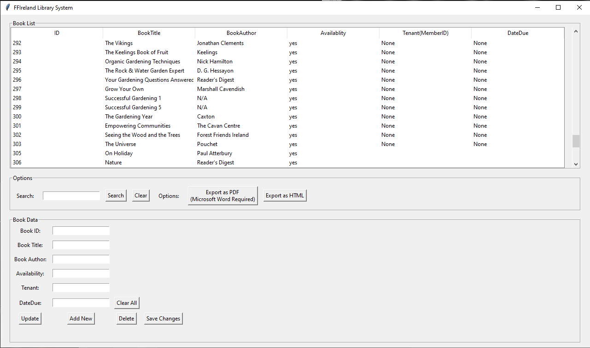

# Library-Management-App
</img>
- A management system to keep track of the book 
inventory of our library.

## High Level Information
The “FFI Library App” was developed with Python with the aim of creating a comprehensive and 
easy-to-use management interface for our library services.
***Python Dependencies:
- tkinter
- sqlite3 (Intrinsic)
- docxtpl
- docx2pdf
- jinja2

## The main structure of the app is as follows:
- Book data is contained within SQLite3 local database file
- This database is loaded into Python GUI app (TKinter)
- Python GUI app displays database entries with functionality to:
- Search through database
- Update, Add, and Delete entries
- Export data from database to PDF file for sharing (Web, email, etc...)
- Export data to html file

## Program consists of various Python scripts and resource files:
- library_gui.py (Main Program): Displays Python GUI for interacting with database
- init_libgui_db.py: Creates the initial database file for use within main program.
- export_docx_pdf.py: Convert library database to pdf
- export_html.py: Convert library database to html
- schema.sql: SQL structure of database
- book_data.txt: txt file of initial book list, used in init_libgui_db.py to create database
- book-list-template.docx: Word doc template for formatting PDF created
